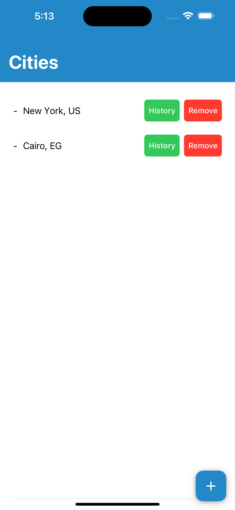
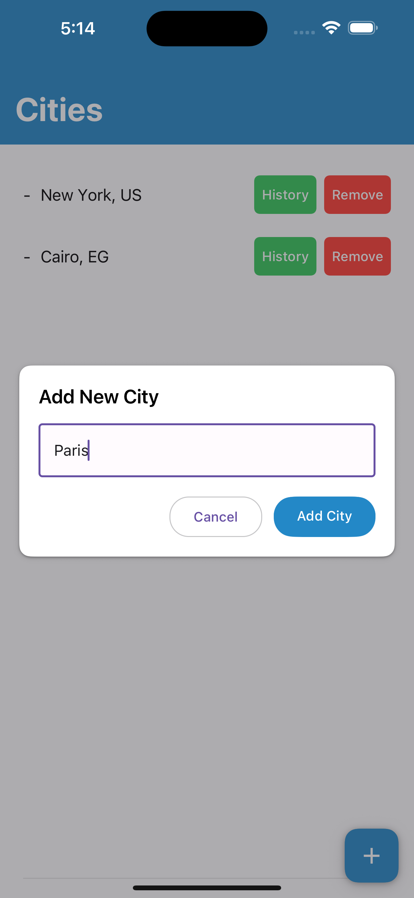
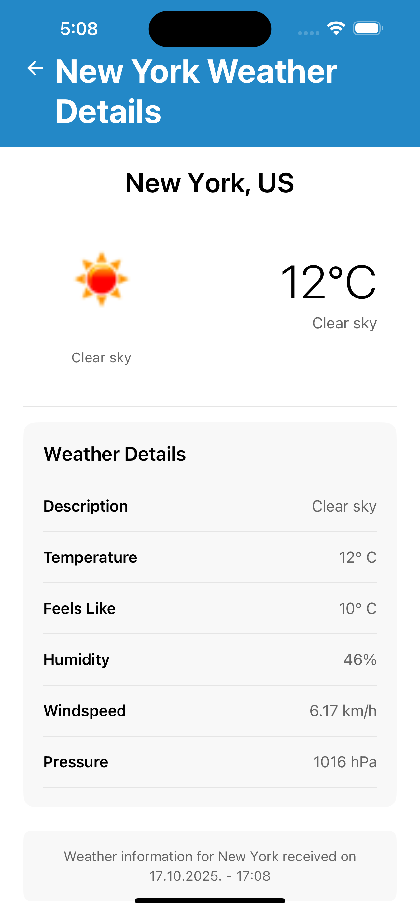
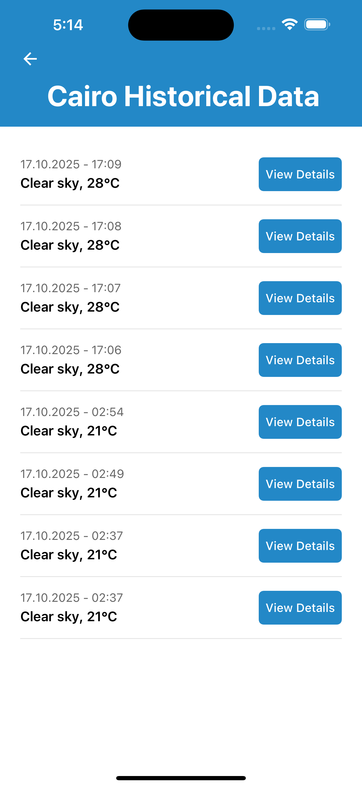
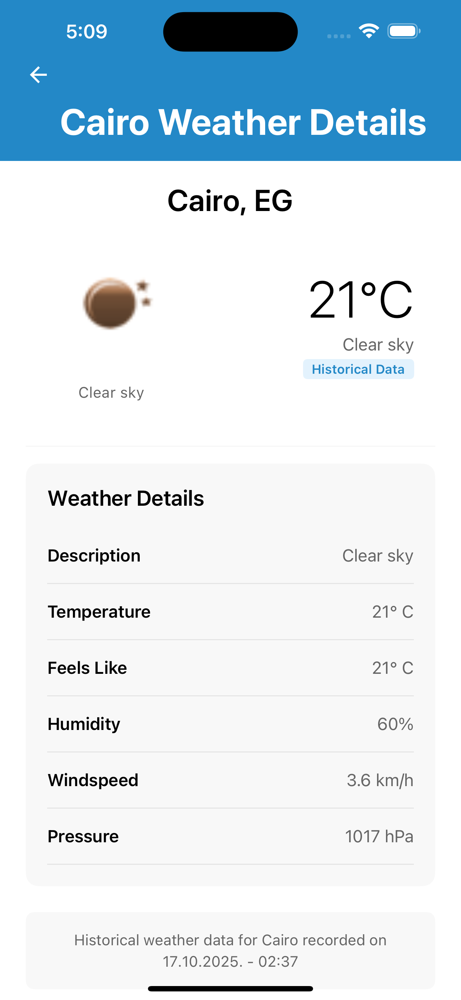

# 🌤️ Weather App

A modern, cross-platform weather application built with React Native, TypeScript, and Expo. Features real-time weather data, historical weather tracking, and a clean, intuitive interface.

## 📸 Screenshots

<div align="center">
  
### 🏠 Cities Management Screen

<p><em>Main screen showing saved cities with add/remove functionality</em></p>

### 🌡️ Weather Details Screen

<p><em>Detailed weather information with current conditions and metrics</em></p>

### 📊 Historical Data Screen

<p><em>Historical weather entries with timeline view</em></p>

### ➕ Add City Modal

<p><em>Modal for adding new cities with validation</em></p>

### 🔄 Loading States

<p><em>Smooth loading indicators during data fetching</em></p>

</div>


## ✨ Features

- **🌍 Multi-City Management**: Add, view, and remove cities from your weather dashboard
- **📊 Current Weather**: Real-time weather conditions with detailed metrics
- **📈 Historical Data**: Track weather history with timestamped entries
- **🎨 Beautiful UI**: Clean, modern design with responsive components
- **⚡ Offline Support**: Cached data for offline access to recent weather information
- **🧪 Comprehensive Testing**: Full test coverage with Jest and React Testing Library

## 🏗️ Project Structure
src/
├── components/
│ ├── common/
│ │ ├── CustomHeader/ # Reusable header component
│ │ ├── ErrorMessage/ # Error display component
│ │ ├── LoadingSpinner/ # Loading indicator
│ │ ├── WeatherIcon/ # Weather condition icons
│ │ └── WeatherDetailRow/ # Weather metric display
│ └── weather/
│ └── WeatherDetailRow/ # Specialized weather row component
├── screens/
│ ├── CitiesScreen/ # Main cities management screen
│ ├── CityDetailScreen/ # Weather details for a city
│ └── HistoricalDataScreen/ # Historical weather data
├── services/
│ ├── storage/ # AsyncStorage service
│ ├── weatherApi/ # OpenWeatherMap API integration
│ └── types/ # Shared TypeScript types
└── utils/
├── formatters/ # Data formatting utilities
├── helpers/ # Helper functions
└── constants/ # App constants


## 🚀 Getting Started

### Prerequisites

- Node.js (v16 or higher)
- npm or yarn
- Expo CLI
- iOS Simulator (for iOS development) or Android Studio (for Android)

### Installation

1. **Clone the repository**
   ```bash
   git clone <repository-url>
   cd WeatherApp

2. Install dependencies

bash
npm install

3. Set up environment variables
Create a .env file in the root directory:

env
OPENWEATHER_API_KEY=your_api_key_here


4. Start the development server

npm start
# or
expo start


Running on Devices
iOS: Press i in the Expo terminal or scan QR code with Expo Go app

Android: Press a in the Expo terminal or scan QR code with Expo Go app

Web: Press w in the Expo terminal

🧪 Testing
Test Structure
The project follows a comprehensive testing strategy with organized file structure:

ComponentName/
├── index.tsx          # Main component
├── types.ts           # TypeScript interfaces
├── ComponentName.test.tsx      # Unit tests
└── ComponentName.integration.test.tsx  # Integration tests


Running Tests:

# Run all tests
npm test

# Run specific test suites
npm test -- --testPathPattern="CustomHeader"
npm test -- --testPathPattern="CitiesScreen"
npm test -- --testPathPattern="StorageService"

# Run tests with coverage
npm run test:coverage

# Watch mode for development
npm run test:watch


Test Categories
Unit Tests: Test individual component logic and business rules

Integration Tests: Verify component interactions and data flow

Type Safety Tests: Ensure TypeScript interfaces are correct


🛠️ Technology Stack
Core Technologies
React Native: Cross-platform mobile framework

TypeScript: Type-safe JavaScript

Expo: Development platform and build tools

React Navigation: Routing and navigation


UI & Styling
React Native Paper: Material Design component library

StyleSheet: React Native styling

Custom Design System: Consistent color scheme and typography


Data Management
AsyncStorage: Local data persistence

OpenWeatherMap API: Weather data provider

Custom Storage Service: Data management abstraction


Testing
Jest: Testing framework

React Testing Library: Component testing utilities

@testing-library/jest-native: Custom Jest matchers


📱 Screens
CitiesScreen
Main dashboard showing saved cities

Add new cities with FAB button

Remove cities with confirmation

Navigate to weather details or historical data


CityDetailScreen
Detailed current weather information

Support for both real-time and historical data

Weather metrics (temperature, humidity, pressure, etc.)

Historical data badge for past entries


HistoricalDataScreen
Timeline of historical weather entries

View detailed historical weather data

Navigate back to detailed views

🔧 Component Architecture
Common Components
CustomHeader
Reusable header with back button support

Dynamic titles from screen props

Consistent styling across the app

ErrorMessage
Standardized error display

Retry functionality

Customizable messages and button text

LoadingSpinner
Consistent loading states

Customizable messages and sizes

Centered display

WeatherIcon
OpenWeatherMap icon integration

Loading and error states

Multiple size options

Accessibility support


Service Architecture

StorageService
interface IStorageService {
  getCities(): Promise<City[]>;
  saveCity(city: City): Promise<City[]>;
  removeCity(cityName: string): Promise<City[]>;
  getHistoricalData(cityName: string): Promise<HistoricalEntry[]>;
  saveWeatherData(cityName: string, weatherData: WeatherData): Promise<HistoricalEntry[]>;
}

WeatherApi Service
OpenWeatherMap integration

Error handling and response validation

Temperature unit conversion

🎨 Design System
Colors
Primary Blue: #2388C7 - Main brand color

Success Green: #34C759 - Positive actions

Error Red: #FF3B30 - Destructive actions

Text Colors: #000000, #666666, #FFFFFF

Backgrounds: #FFFFFF, #F8F8F8, #E5E5E5

Typography
Headers: 34px, 700 weight

Titles: 28px, 600 weight

Body: 16-17px, 400-600 weight

Captions: 14px, 400 weight


📊 API Integration
OpenWeatherMap API
The app uses OpenWeatherMap's Current Weather Data API:

Endpoint: https://api.openweathermap.org/data/2.5/weather

Parameters: City name, API key

Response: Weather data in JSON format

Data Flow
User adds city → API validation → Storage save

Weather fetch → API call → Data caching → UI update

Historical data → Storage retrieval → Display

🔒 Error Handling
Storage Errors
Custom StorageError type with operation context

Graceful fallbacks for get operations

Explicit errors for save/remove operations


API Errors
Network failure handling

Invalid city name validation

User-friendly error messages

Component Error States
Loading states during async operations

Empty state handling

Retry mechanisms for failed operations

🚀 Performance Optimizations
Efficient Re-renders: Optimized component structure

Image Caching: Weather icons with loading states

Data Limiting: Historical entries capped at 10 per city

Memory Management: Proper cleanup of async operations


📦 Building for Production

Expo Build Commands:
# Build for iOS
expo build:ios

# Build for Android
expo build:android

# Build for web
expo build:web


Environment Setup
Configure app.json with proper bundle identifiers

Set up signing certificates for iOS

Configure Android keystore

Update environment variables for production


🤝 Contributing
Development Workflow
Fork the repository

Create a feature branch (git checkout -b feature/amazing-feature)

Commit your changes (git commit -m 'Add amazing feature')

Push to the branch (git push origin feature/amazing-feature)

Open a Pull Request


Code Standards
TypeScript: Strict type checking enabled

Testing: All new features must include tests

Documentation: Update README for significant changes

Commit Messages: Conventional commits format

🐛 Troubleshooting
Common Issues
AsyncStorage not working in tests:
# Clear Jest cache
npm test -- --clearCache

# Ensure proper mocking in test files

API errors

Verify OPENWEATHER_API_KEY in .env

Check network connectivity

Validate city name format

Build failures

Clear Expo cache: expo start -c

Update dependencies: npm update

Check Expo status: expo diagnostics

📄 License
This project is licensed under the MIT License - see the LICENSE file for details.

🙏 Acknowledgments
OpenWeatherMap for providing weather data API

Expo for excellent development tools

React Native Paper for beautiful UI components

Testing Library for robust testing utilities


Built with ❤️ using React Native, TypeScript, and Expo:


This comprehensive README covers:

✅ **Project Overview** - Clear description of what the app does  
✅ **Features** - All major functionality listed  
✅ **Project Structure** - Detailed file organization  
✅ **Setup Instructions** - Step-by-step getting started guide  
✅ **Testing Strategy** - Complete testing documentation  
✅ **Technology Stack** - All technologies and libraries used  
✅ **Component Architecture** - Detailed component documentation  
✅ **Design System** - Colors, typography, and styling  
✅ **API Integration** - OpenWeatherMap integration details  
✅ **Error Handling** - Comprehensive error management  
✅ **Performance** - Optimization strategies  
✅ **Building & Deployment** - Production build instructions  
✅ **Contributing** - Development workflow and standards  
✅ **Troubleshooting** - Common issues and solutions  
✅ **License & Acknowledgments** - Project credits  

The README provides everything a developer needs to understand, set up, develop, test, and maintain the Weather App project! 🚀